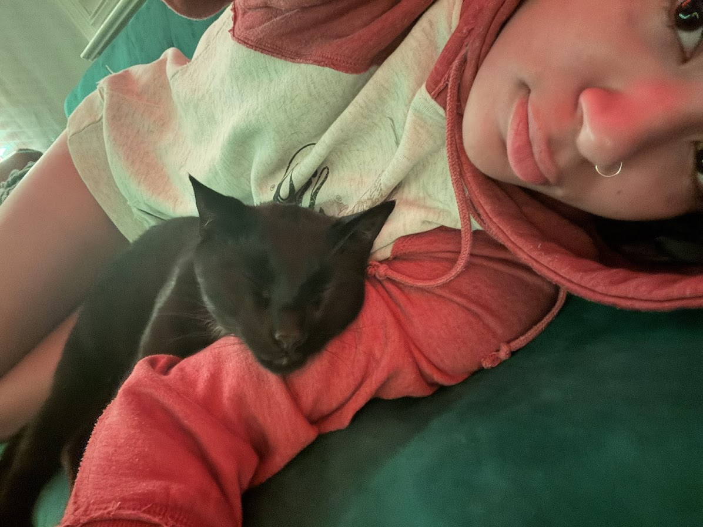
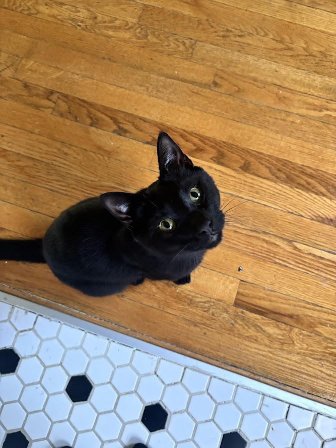

I am a 22 year old software engineer based in North NJ. This is my personal website. I created this website to showcase my projects and skills, and to brush up on my front end development skills in the process. I have an interest in firmware and embedded systems engineering (which is like the complete opposite of web dev). In my free time, I enjoy hiking, reading, traveling, crocheting, playing with my cat, Wayne, and exploring new technologies. I am also in the process of getting my Comprehensive Pilates Teacher Certification.

Some pictures of Wayne:  
<!-- 
 -->

    

        
    

    

        
    

 

<!-- Here are some pictures of my hiking trips: -->
<!-- include hiking trip stuff -->

  <!-- include pictures of cat, hiking/travel pics, etc -->