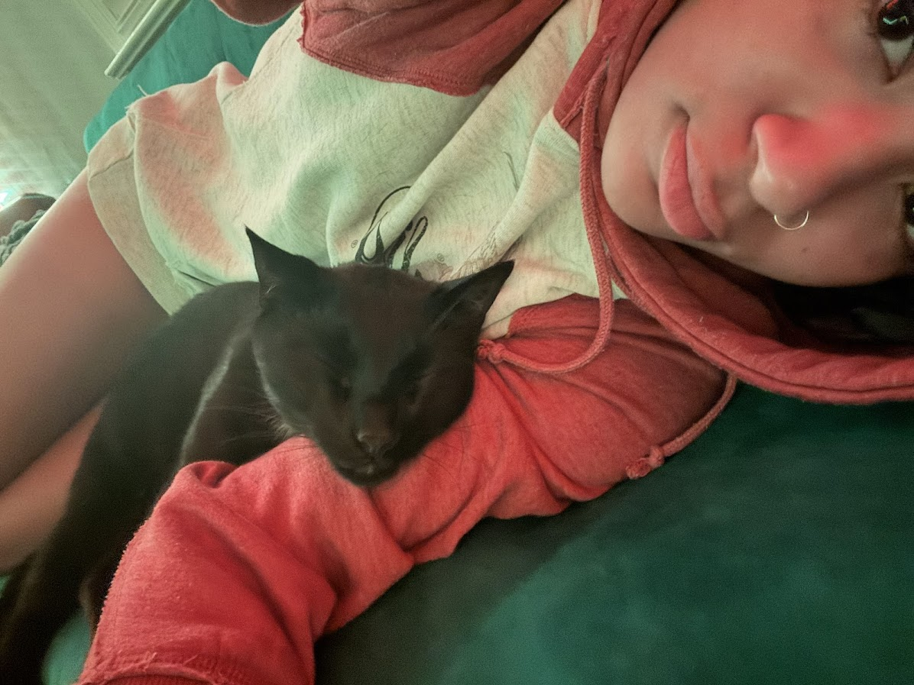
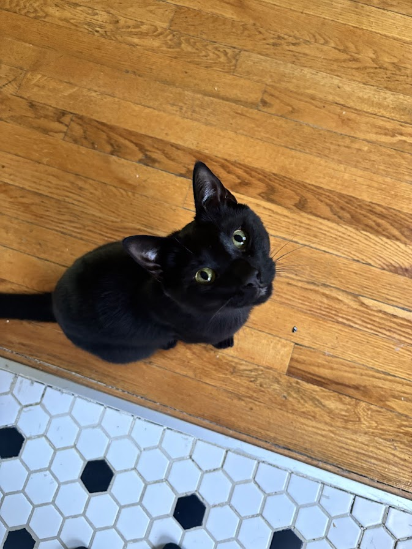

I'm a software engineer based in the NYC area. While my background is in software engineering, I'm currently focusing on moving into data science and analytics. I've always enjoyed figuring out how things work, and now I'm applying that to finding insights in data.

Outside of software and data, I enjoy hiking (Mt. Tammany in NJ is one of my favorites), reading, traveling, and crochet (I crocheted a queen-size blanket that I use to this day. It took me a year). I'm also in the process of getting my Comprehensive Pilates Teacher Certification, which helps me stay balanced.

And then there's Wayne. 

    
    

Wayne is my cat and, effectively, the CEO of my apartment, despite paying no bills.